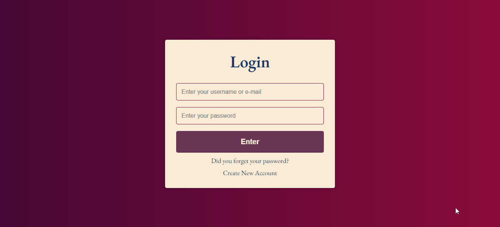

# LOGIN AND SIGN UP PAGES

<h2>This web site was made with HTML, CSS and JavaScript.</h2>

<h3>On this page, you can enter a web page you have previously registered.</h3>

<h3> Or if you are not registered you can apply.</h3>

<h3>Or if you forgot your password, you can request a new password via your e-mail. </h3>

<h3> I used JavaScript's : </h3>

 addEventListener('click', function(){}), 

 addEventListener('DOMContentLoaded', function(){}), 

 if (){return}, 

 innerHTML = " "  
Preview:</h3>

<b>Enjoy Coding ❤</b>
